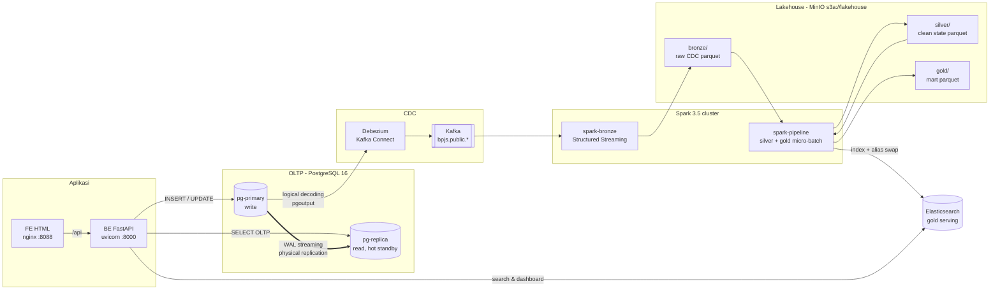

# ADAM-praktek-1 — Arsitektur Big Data BPJS Kesehatan

Platform data untuk aplikasi BPJS Kesehatan yang mengelola **peserta**, **faskes**, dan
**kunjungan** (termasuk *diagnosis awal* berupa kalimat bebas). OLTP dilayani PostgreSQL
(primary + read replica real-time); analitik dan pencarian dilayani pipeline
**CDC → Medallion (Bronze/Silver/Gold)** berbasis Debezium, Kafka, Spark, MinIO, dan Elasticsearch.

## 1. Arsitektur



### Komponen & peran

| Layer | Teknologi | Peran |
|---|---|---|
| FE | HTML + JS (nginx) | Halaman Peserta, Faskes, Kunjungan (input + search), Dashboard |
| BE | Python FastAPI / uvicorn | REST API; **read/write splitting** (write → primary, read → replica, search/dashboard → ES) |
| OLTP | PostgreSQL 16 primary | Sumber kebenaran; `wal_level=logical` |
| Read replica | PostgreSQL 16 hot standby | Physical streaming replication via slot `replica1_slot`, lag sub-detik |
| CDC | Debezium 2.7 (pgoutput) → Kafka 3.8 (KRaft) | Menangkap setiap INSERT/UPDATE/DELETE ke topic `bpjs.public.<tabel>` |
| Bronze | Spark Structured Streaming → Parquet di MinIO | Event CDC mentah, append-only, dipartisi `table_name/ingest_date` |
| Silver | Spark batch → Parquet di MinIO | State terkini per PK (dedup by LSN), cleansing, masking PII |
| Gold | Spark batch → Parquet MinIO + **Elasticsearch** | Dokumen kunjungan terdenormalisasi + data mart agregat |

## 2. Model Data (OLTP)

```
faskes (id, kode_faskes, nama, jenis, tingkat[FKTP|FKRTL], alamat, kota, provinsi, created_at, updated_at)
peserta (id, no_kartu[13], nik[16], nama, tanggal_lahir, jenis_kelamin, alamat, no_hp,
         segmen[PBI|PPU|PBPU|BP], kelas_rawat[1-3], faskes_id -> faskes, created_at, updated_at)
kunjungan (id, no_kunjungan, peserta_id -> peserta, faskes_id -> faskes, tanggal_kunjungan, poli,
           jenis_kunjungan, diagnosis_awal TEXT (kalimat lengkap), status, created_at, updated_at)
```

DDL: [postgres/primary/init/01-schema.sql](postgres/primary/init/01-schema.sql)

## 3. Medallion Architecture

| Layer | Lokasi | Isi | Cara tulis |
|---|---|---|---|
| **Bronze** | `s3a://lakehouse/bronze/cdc_events/table_name=*/ingest_date=*/` | Payload JSON Debezium utuh + metadata Kafka (topic, partition, offset, LSN, ts) | Streaming append, trigger 15 dtk, checkpoint di MinIO |
| **Silver** | `s3a://lakehouse/silver/{faskes,peserta,kunjungan}/` | 1 baris per PK (event terakhir by `source_lsn`, `kafka_offset`), delete dibuang, teks dirapikan, tanggal Debezium dikonversi, NIK & no HP di-*mask*, `diagnosis_norm` untuk text mining. `kunjungan` dipartisi `periode=yyyy-MM` | Batch overwrite |
| **Gold** | `s3a://lakehouse/gold/<mart>/` + Elasticsearch | Lihat tabel di bawah | Batch overwrite + ES versioned index & alias swap |

### Data mart gold (Elasticsearch)

| Alias ES | Isi | Dipakai oleh |
|---|---|---|
| `kunjungan` | Kunjungan + nama pasien, umur, faskes, kota (denormalized). `diagnosis_awal` memakai analyzer **Bahasa Indonesia** (stopword + stemmer) | Halaman **Kunjungan** → search nama pasien / faskes / diagnosis |
| `mart_kunjungan_per_poli` | jumlah kunjungan & pasien unik per poli | Dashboard |
| `mart_kunjungan_per_faskes` | jumlah kunjungan & pasien unik per faskes | Dashboard |
| `mart_diagnosis_wordcloud` | top-200 kata diagnosis (tokenisasi + stopword ID + filter kata klinis umum) | Dashboard word cloud |
| `mart_ringkasan` | KPI total | Dashboard |

**Publikasi atomik**: setiap siklus gold menulis ke index baru `<alias>_vYYYYMMDDHHMMSS`, lalu alias dipindah
dalam satu request `_aliases`. FE tidak pernah membaca index setengah jadi dan record yang dihapus di
sumber ikut hilang dari ES.

## 4. Menjalankan

Kebutuhan: Docker Desktop (BuildKit aktif), RAM bebas ±8 GB.

```bash
# 0. siapkan kredensial (isi password sesuai keinginan)
cp .env.example .env

# 1. build & jalankan seluruh stack
docker compose up -d --build

# 2. cek connector Debezium terdaftar & RUNNING
curl http://localhost:8083/connectors/bpjs-postgres-cdc/status

# 3. isi data dummy (ditulis ke primary)
docker compose exec backend python -m app.seed --faskes 40 --peserta 1000 --kunjungan 5000

# 4. (opsional) simulasi kunjungan real-time 2/detik
docker compose exec backend python -m app.seed --stream --rate 2

# log pipeline
docker compose logs -f spark-bronze spark-pipeline
```

| URL | Keterangan |
|---|---|
| http://localhost:8088 | Frontend (Beranda, Peserta, Faskes, Kunjungan, Dashboard) |
| http://localhost:8000/docs | Swagger API |
| http://localhost:9001 | MinIO console (user/password: lihat `MINIO_ROOT_USER` / `MINIO_ROOT_PASSWORD` di `.env`) — lihat bucket `lakehouse` |
| http://localhost:8090 | Spark master UI |
| http://localhost:9200 | Elasticsearch |
| http://localhost:5601 | Kibana (`docker compose --profile tools up -d kibana`) |

Verifikasi read replica:

```bash
docker compose exec pg-primary psql -U bpjs_admin -d bpjs -c "select client_addr, state, replay_lag from pg_stat_replication"
docker compose exec pg-replica psql -U bpjs_admin -d bpjs -c "select pg_is_in_recovery(), count(*) from kunjungan"
```

## 5. API

| Method | Endpoint | Sumber |
|---|---|---|
| GET/POST | `/api/faskes` | replica / primary |
| GET/POST | `/api/peserta`, GET `/api/peserta/{id}` | replica / primary |
| GET/POST | `/api/kunjungan` | replica / primary |
| GET | `/api/kunjungan/search?q=&field=semua\|pasien\|faskes\|diagnosis&poli=&page=&size=` | ES `kunjungan` |
| GET | `/api/dashboard/{ringkasan,per-poli,per-faskes,wordcloud}` | ES mart |
| GET | `/api/system/replication`, `/api/system/gold` | primary + replica / ES |

Search memakai `multi_match` tipe `bool_prefix` + `fuzziness: AUTO` (bisa ketik sebagian & toleran typo),
highlight `<mark>`, dan facet per poli.

## 6. Latensi data

| Jalur | Latensi tipikal |
|---|---|
| Primary → read replica | < 1 detik (async streaming) |
| Primary → Kafka (Debezium) | < 1 detik |
| Kafka → bronze | ≤ 15 detik (trigger) |
| bronze → silver → gold/ES | ≤ `PIPELINE_INTERVAL_SECONDS` (60 dtk) + waktu proses |

## 7. Catatan untuk produksi

- **Table format**: ganti parquet polos di silver/gold dengan **Delta Lake / Apache Iceberg** agar bisa `MERGE` inkremental (bukan overwrite penuh) dan time travel.
- **Orkestrasi**: `pipeline_loop.py` diganti DAG Airflow/Dagster; pisahkan jadwal silver & gold.
- **Replica**: tambah replica lebih dari satu + PgBouncer/HAProxy; `synchronous_commit=remote_apply` bila butuh read-your-writes ketat.
- **Kafka**: 3 broker, replication factor 3, Schema Registry (Avro) menggantikan JSON.
- **Keamanan**: aktifkan TLS & auth di ES/Kafka/MinIO, secret di vault (bukan `.env`), RBAC & audit akses data kesehatan (UU PDP).
- **Elasticsearch**: ≥ 3 node, replika shard ≥ 1, ILM untuk index versi lama.

## 8. Struktur repo

```
docker-compose.yml          seluruh stack
.env                        kredensial dev
postgres/primary/init/      DDL, publication, role replikasi & debezium
postgres/replica/           entrypoint pg_basebackup -> hot standby
debezium/                   konfigurasi connector Postgres
spark/Dockerfile            image Spark + jar Kafka, S3A, ES
spark/jobs/                 bronze_stream.py, silver.py, gold.py, pipeline_loop.py
backend/app/                FastAPI (routers, db read/write split, ES, seed)
frontend/                   HTML/CSS/JS
nginx/                      reverse proxy FE -> BE
```
